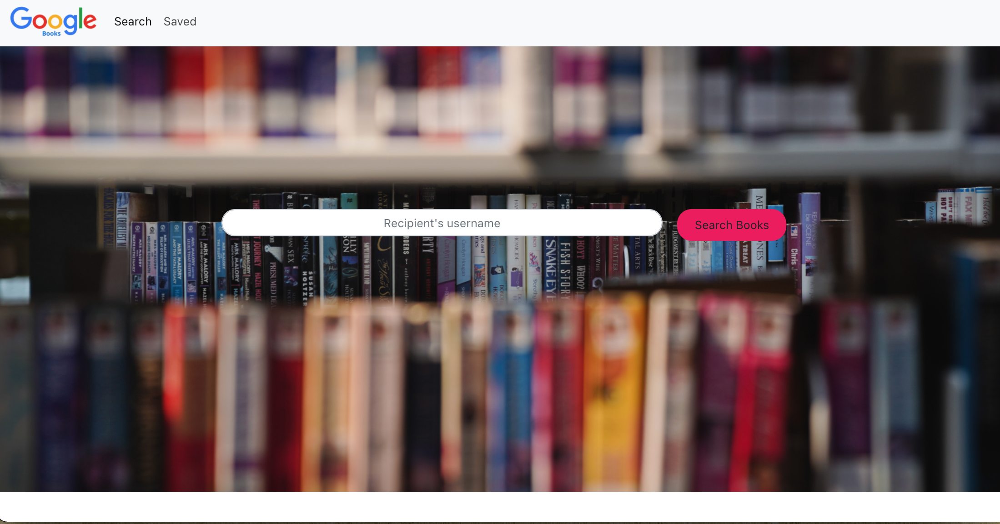

# Books
## Table of Contents 

* [Usage](#usage)
* [User Story](#userstory)
* [Technologies](#technologies)
* [Credits](#credits)
* [License](#license)

## Usage 

Example of front page

Example of dashboard page

Heroku Deployment (https://mighty-everglades-62236.herokuapp.com/)

# User Story
An application created using the MERN stack and allows users to search for books via the Google Books API. Search results are dynamically rendered in the UI and users have the option to save and/or delete books.

# Technologies
* React JS
* MongoDB
* Mongoose
* Express JS
* Node
* Axios

## Questions
If you have any questions about the repo, please [open an issue](https://github.com/Ofarrell23/Books/issues or contact me via email at keyabug@gmail.com. You can find more of my work on my GitHub, [Ofarrell23](https://github.com/Ofarrell23/).
    
## Credits
Below is a list of third-party tutorials used to help facilitate this project. There were no collaborators for this project.

* [Credits] (https://www.w3schools.com/tags/att_img_alt.asp)
* [Credits] (https://www.vikingcodeschool.com/html5-and-css3/html5-semantic-tags)
* [Credits] (https://developer.mozilla.org/en-US/docs/Web/JavaScript)

# License

